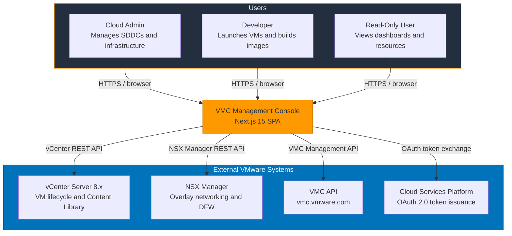
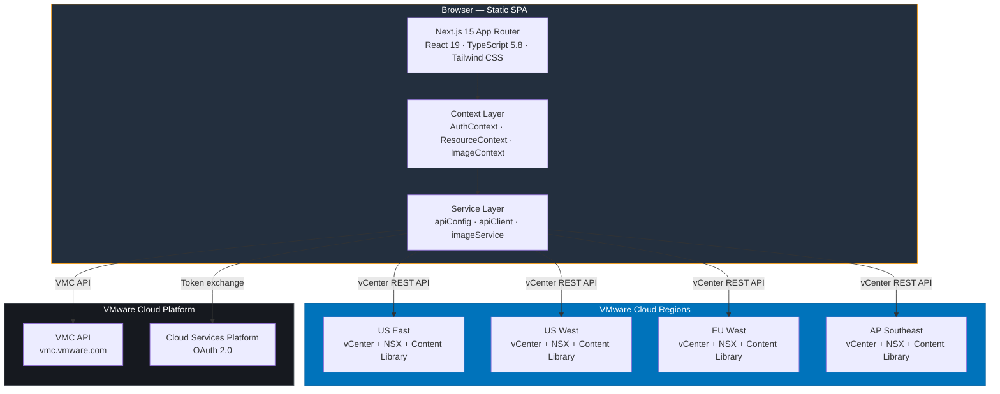
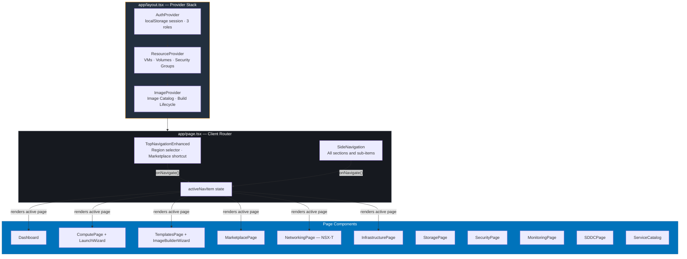
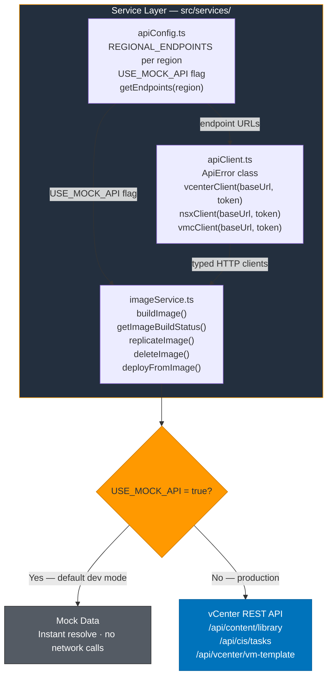
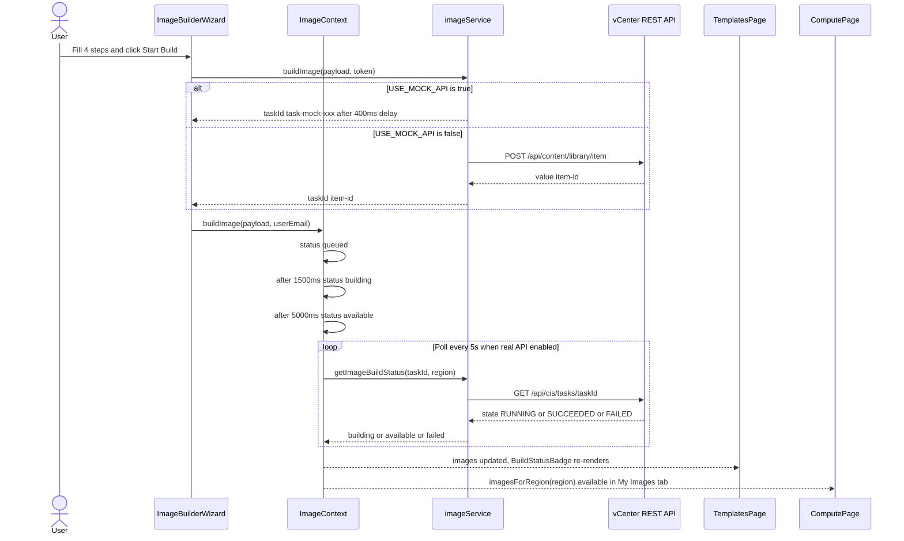
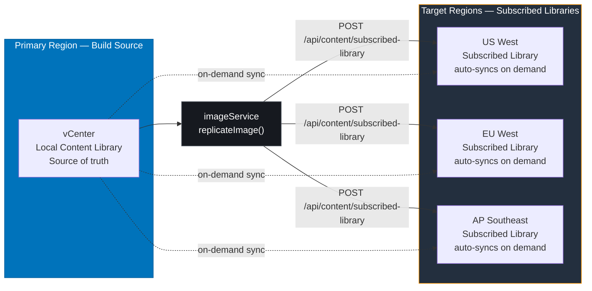
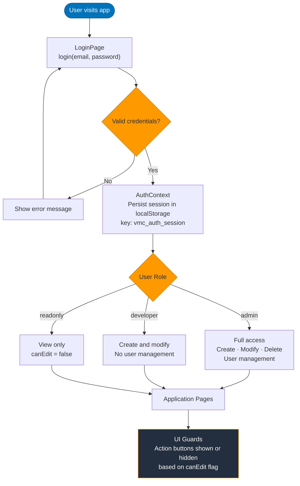
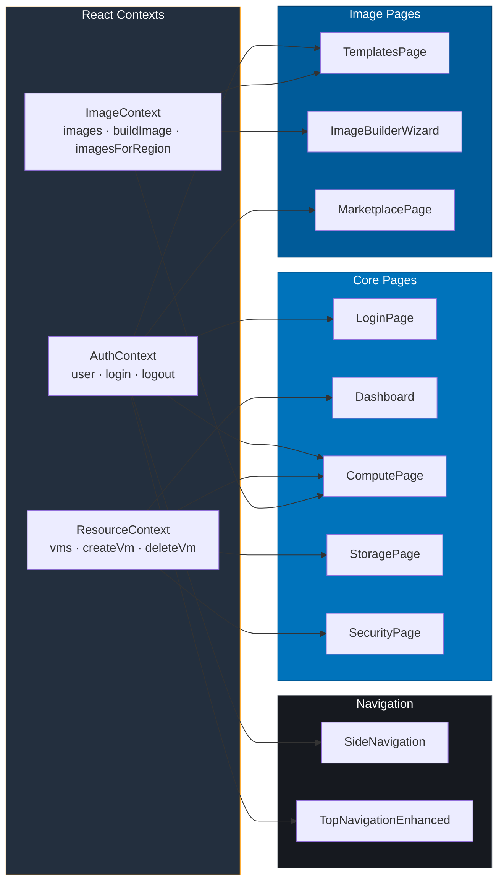
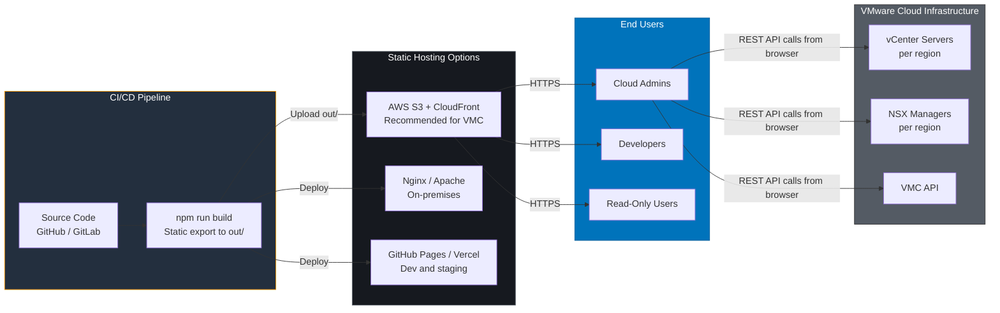
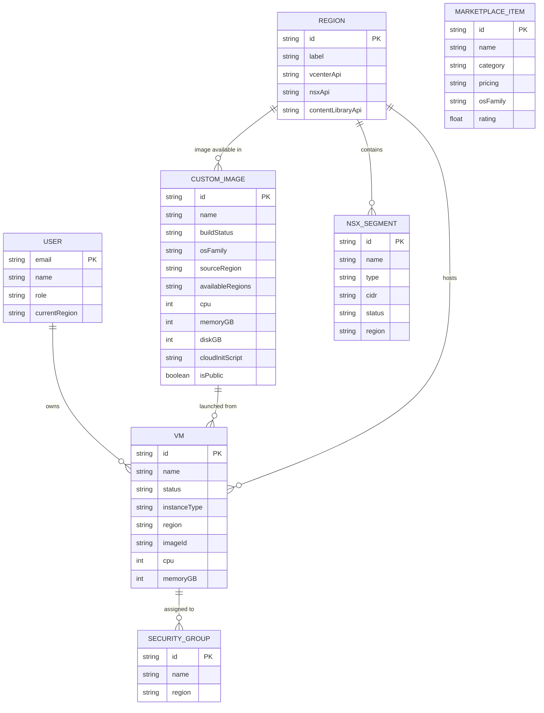

# High-Level Design (HLD)

> All diagrams use standard [Mermaid](https://mermaid.js.org/) syntax and render on GitHub, GitLab, and VS Code (Markdown Preview).

---

## 1. System Context

Who uses the system and what external systems it integrates with.

---

## 2. High-Level Architecture

The three main tiers of the application.

---

## 3. Frontend Layer Detail

Internal structure of the SPA — providers, router, and pages.

---

## 4. Service Layer

Mock vs real API switching via a single environment flag.

---

## 5. Image Build Pipeline

End-to-end flow from wizard submission to an available image.

---

## 6. Regional Content Library Replication

How a built image is replicated to additional regions.

---

## 7. Authentication and Role-Based Access

Login flow and permission enforcement throughout the UI.

---

## 8. Component and Context Dependency Map

Which page components consume which React contexts.

---

## 9. Deployment Architecture

How the static export is built, hosted, and consumed.

---

## 10. Data Model

Key entities and their relationships.

